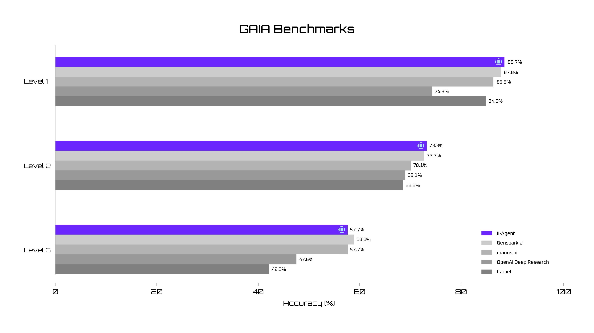

<p align="center">
  
</p>

[](https://github.com/Intelligent-Internet/ii-agent/stargazers)
[](https://opensource.org/licenses/Apache-2.0)
[](https://ii.inc/web/blog/post/ii-agent)
[](https://ii-agent-gaia.ii.inc/)

# II Agent

II-Agent is an open-source intelligent assistant designed to streamline and enhance workflows across multiple domains. It represents a significant advancement in how we interact with technology—shifting from passive tools to intelligent systems capable of independently executing complex tasks.

## Introduction
https://github.com/user-attachments/assets/d0eb7440-a6e2-4276-865c-a1055181bb33


## Overview

II Agent is built around providing an agentic interface to Anthropic Claude models. It offers:

- A CLI interface for direct command-line interaction
- A WebSocket server that powers a modern React-based frontend
- Integration with Google Cloud's Vertex AI for API access to Anthropic models

## Core Capabilities

II-Agent is a versatile open-source assistant built to elevate your productivity across domains:

| Domain | What II‑Agent Can Do |
|--------|----------------------|
| Research & Fact‑Checking | Multistep web search, source triangulation, structured note‑taking, rapid summarization |
| Content Generation | Blog & article drafts, lesson plans, creative prose, technical manuals, Website creations |
| Data Analysis & Visualization | Cleaning, statistics, trend detection, charting, and automated report generation |
| Software Development | Code synthesis, refactoring, debugging, test‑writing, and step‑by‑step tutorials across multiple languages |
| Workflow Automation | Script generation, browser automation, file management, process optimization |
| Problem Solving | Decomposition, alternative‑path exploration, stepwise guidance, troubleshooting |

## Methods

The II-Agent system represents a sophisticated approach to building versatile AI agents. Our methodology centers on:

1. **Core Agent Architecture and LLM Interaction**
   - System prompting with dynamically tailored context
   - Comprehensive interaction history management
   - Intelligent context management to handle token limitations
   - Systematic LLM invocation and capability selection
   - Iterative refinement through execution cycles

2. **Planning and Reflection**
   - Structured reasoning for complex problem-solving
   - Problem decomposition and sequential thinking
   - Transparent decision-making process
   - Hypothesis formation and testing

3. **Execution Capabilities**
   - File system operations with intelligent code editing
   - Command line execution in a secure environment
   - Advanced web interaction and browser automation
   - Task finalization and reporting
   - Specialized capabilities for various modalities (Experimental) (PDF, audio, image, video, slides)
   - Deep research integration

4. **Context Management**
   - Token usage estimation and optimization
   - Strategic truncation for lengthy interactions
   - File-based archival for large outputs

5. **Real-time Communication**
   - WebSocket-based interface for interactive use
   - Isolated agent instances per client
   - Streaming operational events for responsive UX

## GAIA Benchmark Evaluation

II-Agent has been evaluated on the GAIA benchmark, which assesses LLM-based agents operating within realistic scenarios across multiple dimensions including multimodal processing, tool utilization, and web searching.

We identified several issues with the GAIA benchmark during our evaluation:

- **Annotation Errors**: Several incorrect annotations in the dataset (e.g., misinterpreting date ranges, calculation errors)
- **Outdated Information**: Some questions reference websites or content no longer accessible
- **Language Ambiguity**: Unclear phrasing leading to different interpretations of questions

Despite these challenges, II-Agent demonstrated strong performance on the benchmark, particularly in areas requiring complex reasoning, tool use, and multi-step planning.


You can view the full traces of some samples here: [GAIA Benchmark Traces](https://ii-agent-gaia.ii.inc/)

## Requirements

- Python 3.10+
- Node.js 18+ (for frontend)
- Google Cloud project with Vertex AI API enabled or Anthropic API key

## Environment

### Environment Variables

Create a `.env` file in the root directory with the following variables:

```bash
# Image and Video Generation Tool
OPENAI_API_KEY=your_openai_key
OPENAI_AZURE_ENDPOINT=your_azure_endpoint
# Search Provider
TAVILY_API_KEY=your_tavily_key
#JINA_API_KEY=your_jina_key
#FIRECRAWL_API_KEY=your_firecrawl_key
# For Image Search and better search results use SerpAPI
#SERPAPI_API_KEY=your_serpapi_key 

STATIC_FILE_BASE_URL=http://localhost:8000/

#If you are using Anthropic client
ANTHROPIC_API_KEY=
#If you are using Goolge Vertex (recommended if you have permission extra throughput)
#GOOGLE_APPLICATION_CREDENTIALS=
```

### Frontend Environment Variables

For the frontend, create a `.env` file in the frontend directory:

```bash
NEXT_PUBLIC_API_URL=http://localhost:8000
```

## Installation

1. Clone the repository
2. Set up Python environment:
   ```bash
   python -m venv .venv
   source .venv/bin/activate  # On Windows: .venv\Scripts\activate
   pip install -e .
   ```

3. Set up frontend (optional):
   ```bash
   cd frontend
   npm install
   ```

## Usage

### Command Line Interface

If you want to use anthropic client, set `ANTHROPIC_API_KEY` in `.env` file and run:
```bash
python cli.py 
```

If you want to use vertex, set `GOOGLE_APPLICATION_CREDENTIALS` in `.env` file and run:
```bash
python cli.py --project-id YOUR_PROJECT_ID --region YOUR_REGION
```

Options:
- `--project-id`: Google Cloud project ID
- `--region`: Google Cloud region (e.g., us-east5)
- `--workspace`: Path to the workspace directory (default: ./workspace)
- `--needs-permission`: Require permission before executing commands
- `--minimize-stdout-logs`: Reduce the amount of logs printed to stdout

### Web Interface

1. Start the WebSocket server:

When using Anthropic client:
```bash
export STATIC_FILE_BASE_URL=http://localhost:8000
python ws_server.py --port 8000
```

When using Vertex:
```bash
export STATIC_FILE_BASE_URL=http://localhost:8000
python ws_server.py --port 8000 --project-id YOUR_PROJECT_ID --region YOUR_REGION
```

2. Start the frontend (in a separate terminal):

```bash
cd frontend
npm run dev
```

3. Open your browser to http://localhost:3000

## Project Structure

- `cli.py`: Command-line interface
- `ws_server.py`: WebSocket server for the frontend
- `src/ii_agent/`: Core agent implementation
  - `agents/`: Agent implementations
  - `llm/`: LLM client interfaces
  - `tools/`: Tool implementations
  - `utils/`: Utility functions

## Conclusion

The II-Agent framework, architected around the reasoning capabilities of large language models like Claude 3.7 Sonnet, presents a comprehensive and robust methodology for building versatile AI agents. Through its synergistic combination of a powerful LLM, a rich set of execution capabilities, an explicit mechanism for planning and reflection, and intelligent context management strategies, II-Agent is well-equipped to address a wide spectrum of complex, multi-step tasks. Its open-source nature and extensible design provide a strong foundation for continued research and development in the rapidly evolving field of agentic AI.

## Acknowledgement

We would like to express our sincere gratitude to the following projects and individuals for their invaluable contributions that have helped shape this project:

- **AugmentCode**: We have incorporated and adapted several key components from the [AugmentCode project](https://github.com/augmentcode/augment-swebench-agent). AugmentCode focuses on SWE-bench, a benchmark that tests AI systems on real-world software engineering tasks from GitHub issues in popular open-source projects. Their system provides tools for bash command execution, file operations, and sequential problem-solving capabilities designed specifically for software engineering tasks.

- **Manus**: Our system prompt architecture draws inspiration from Manus's work, which has helped us create more effective and contextually aware AI interactions.

- **Index Browser Use**: We have built upon and extended the functionality of the [Index Browser Use project](https://github.com/lmnr-ai/index/tree/main), particularly in our web interaction and browsing capabilities. Their foundational work has enabled us to create more sophisticated web-based agent behaviors.

We are committed to open source collaboration and believe in acknowledging the work that has helped us build this project. If you feel your work has been used in this project but hasn't been properly acknowledged, please reach out to us.

